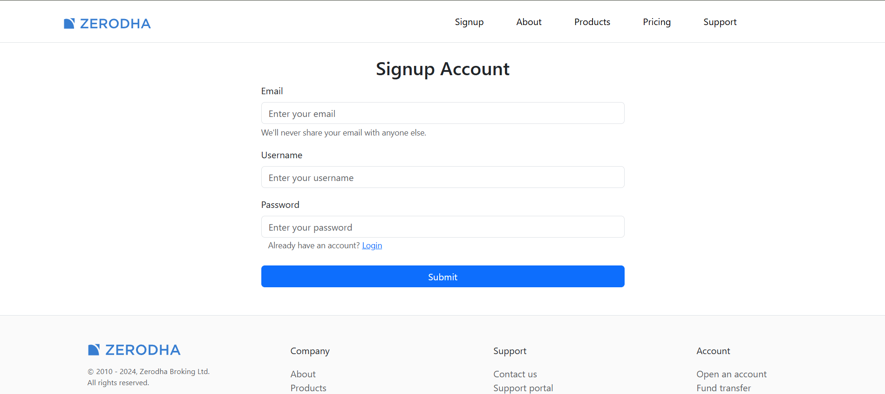
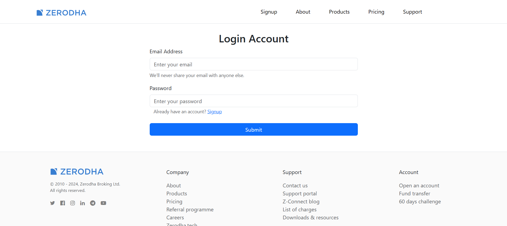
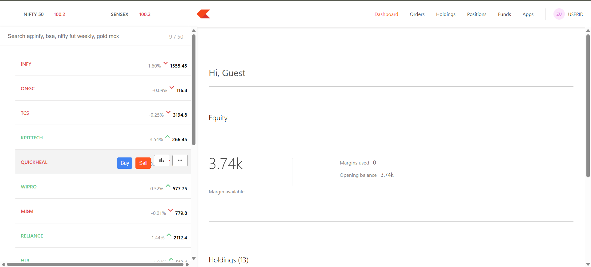
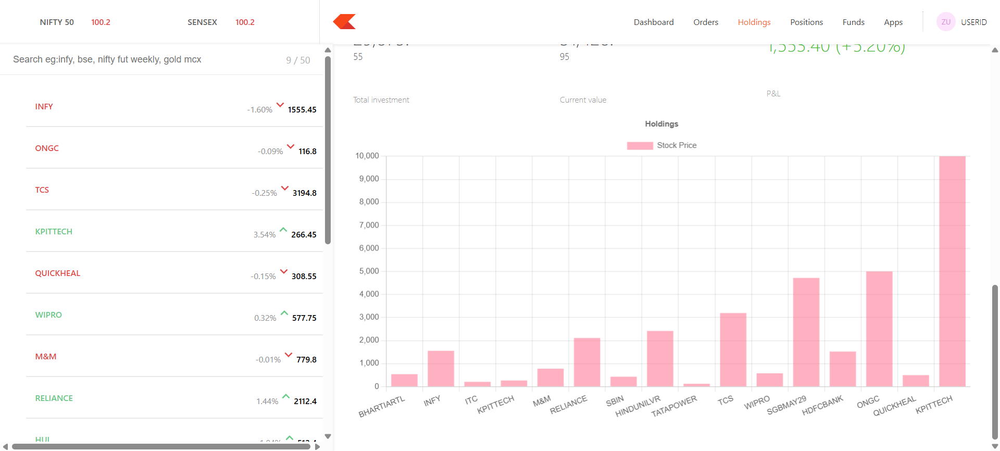
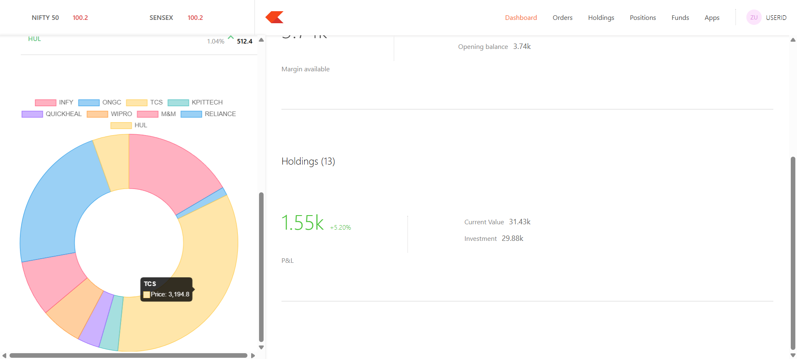
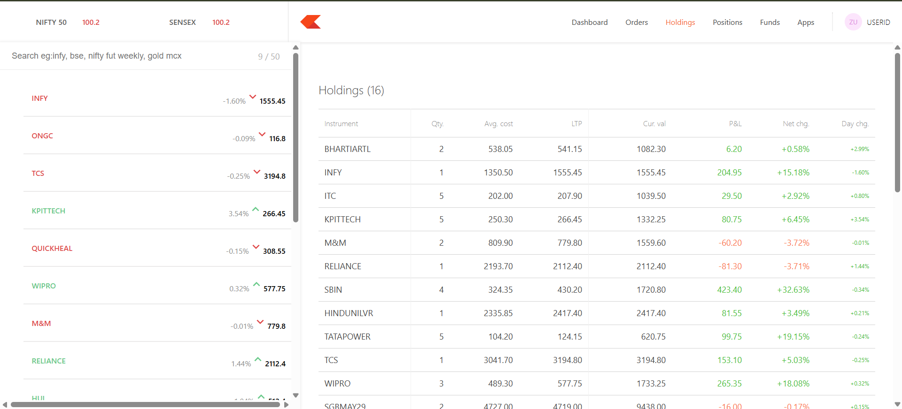
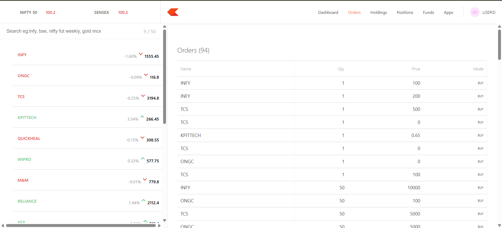
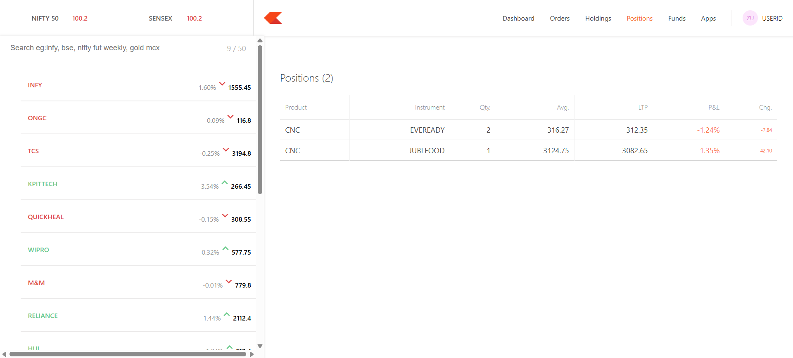
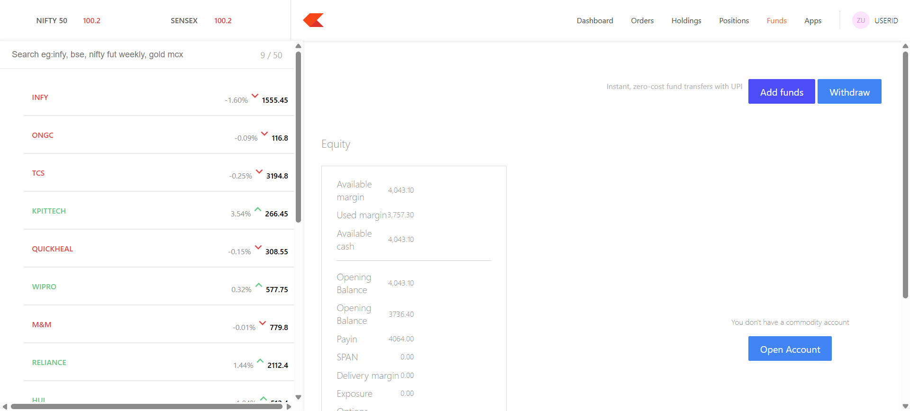

# 📈 Zerodha Clone - Full Stack Trading Platform


A fully functional, full-stack clone of the Zerodha trading platform. This project demonstrates complex state management, real-time database interactions, and a secure REST API handling user portfolios, orders, and holdings.

## 🔗 Live Links
* **Application:** https://zerodha-frontend-8jsv.onrender.com
* **Dashboard:** https://zerodha-dashboard-ks5n.onrender.com

*(Note: The backend is hosted on a free Render instance, so it may take 30-50 seconds to spin up on the first load!)*

---

## 🏗 Architecture & Repositories
This application is built using a Polyrepo architecture to ensure separation of concerns between the client interface, admin tools, and the server.

1. **[Frontend UI](Insert GitHub Link):** The main user-facing application where clients can view the market, buy/sell stocks, and track their portfolio.
2. **[Dashboard](Insert GitHub Link):** A protected routing interface for viewing system-wide positions, funds, and aggregate holding data.
3. **[Backend Server](Insert GitHub Link):** The central Node.js/Express API that processes trades, calculates P&L, and interacts with the MongoDB database.

---

## ✨ Key Features
* **Live Order Execution:** Users can place 'BUY' and 'SELL' orders that instantly update their active holdings and available margins.
* **Portfolio Calculations:** Real-time calculation of current stock value, Net P&L, and Day changes based on simulated market prices.
* **Cross-Origin Security:** Strictly configured CORS policies ensuring the database only accepts requests from the verified Frontend and Dashboard domains.
* **Responsive UI:** Clean, modern interface built with React, utilizing Axios for seamless data fetching and error handling.

---

## 📸 Project Showcase

This section highlights the user experience across both the Frontend client application and the detailed Admin Dashboard.

### Part 1: Client Frontend Application
The main landing page, secure authentication, and user-facing screens.

#### Landing Page Hero Section
This section mimics the main Zerodha marketing page, providing entry points for the application.


#### User Authentication (Signup & Login)
Secure signup and login pages that authenticate users via the Node.js backend.



### Part 2: Dashboard
The core complex UI for managing portfolios, executing simulated trades, and viewing interactive charts.

#### Dashboard Summary View ("Console")
An overview of the user's equity, margins used, and active portfolio P&L.


#### Portfolio & Holdings (Interactive Data Visualization)
The interface for viewing your currently owned stocks. Highlighting both the linear bar graph for stock prices and the interactive donut chart for portfolio diversification.



#### Detailed Portfolio Tables (Holdings, Orders, & Positions)
Clean, professional data tables showing raw data for the portfolio (Holdings), complete trade history (Orders), and active day trades (Positions).




#### Funds & Margin Management
An interface to view available cash, used margins, and simulated options to add/withdraw funds to your trading account.


---

## 💻 Run Locally

To run this project on your local machine, you will need to clone all three repositories and set up your environment variables.

### 1. Start the Backend
```
git clone https://github.com/Manashay/zerodha-backend.git
cd zerodha-backend
npm install

```

Create a .env file in the backend root directory and add your MongoDB URI:
```
MONGO_URL=your_mongodb_connection_string
PORT=3002
```

Start the server:
```
npm start
```

### 2. Start the Frontend & Dashboard

Open two new terminal windows and run the following for both the Frontend and the Dashboard repositories:

```
git clone https://github.com/Manashay/zerodha-frontend.git
cd zerodha-frontend
npm install
npm start

git clone https://github.com/Manashay/zerodha-dashboard.git
cd zerodha-dashboard
npm install
npm start

```
*(Ensure that your Axios base URLs in the frontend code are pointing to http://localhost:3002 for local development)*

## 👨‍💻 Author
Manashay
  
* One step closer to become a Software Engineer | BCCA
* [LinkedIn] (https://www.linkedin.com/in/manashe-chawre-888531286/)
